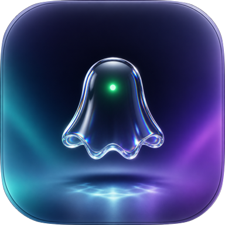
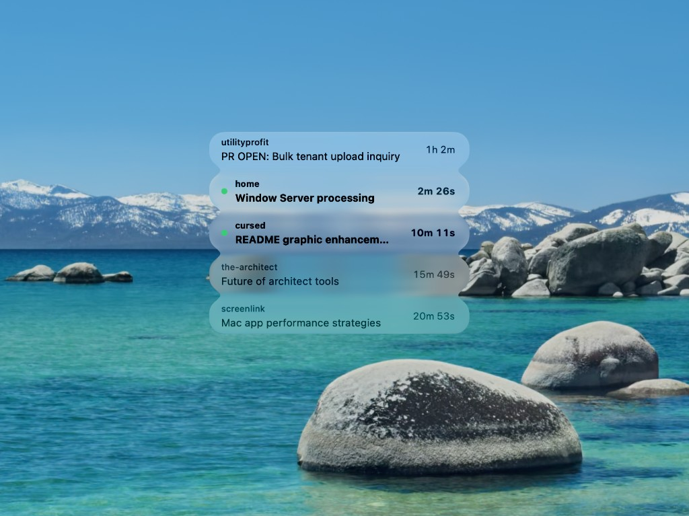
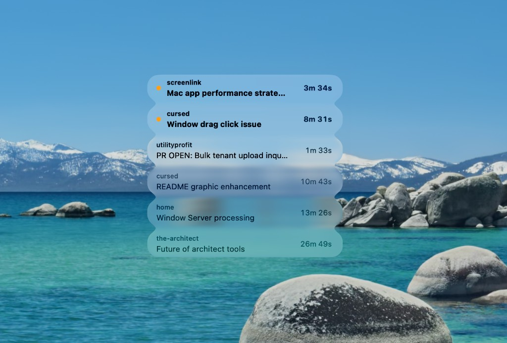

<div align="center">



# cursed

**Which of your Cursor, ChatGPT, and Claude Code conversations are running, how long ago you last said anything
to each of them, and which ones finished while you were looking somewhere else.**

<a href="https://github.com/dsalehipour/Cursed/releases/latest/download/cursed.zip"></a>

<sub>Apple Silicon · macOS 26 or later · 1.7 MB ·
<a href="https://github.com/dsalehipour/Cursed/releases/latest">release notes</a> ·
<a href="#build-from-source">build from source</a></sub>

<br>



<sub>A tiny always-on-top window: one run in flight, two green dots for work that finished while you
were away, two rows already dealt with.</sub>

<br>

`Swift 6` · `no dependencies` · `read-only` · `~0.1% of a core`

[Install](#install) · [States](#what-the-states-mean) · [Dragging](#clicking-versus-dragging) ·
[How it knows](#how-it-knows) · [Performance](#performance) · [Development](#development)

</div>

Native Swift, no dock icon, floats above other apps including full-screen ones, and never takes
keyboard focus when you click it.

The window itself draws nothing. Each row is its own Liquid Glass shape inside a
`GlassEffectContainer`, spaced closely enough that they merge into a single continuous surface
and then fluidly separate and reflow as runs start and finish. The glass is the `clear` variant,
so there is very little between the text and your desktop.

That transparency sets the visual budget: with almost no scrim to work against, state is carried
by text weight and opacity rather than by colour, and the only mark anywhere on screen is a
single green dot.

## Install

Apple Silicon, macOS 26 or later. Cursor, the ChatGPT Mac app, and Claude Code (Desktop or CLI)
are all optional — the panel reads whichever of them is there.

1. [**Download `cursed.zip`**](https://github.com/dsalehipour/Cursed/releases/latest/download/cursed.zip),
   unzip it, and drag `cursed.app` to Applications.
2. Open it. The first launch is refused, because the app is signed but not notarized by Apple.
3. Go to **System Settings › Privacy & Security**, scroll to Security, and click **Open Anyway**,
   which is offered for about an hour after the refusal. Then open the app again.

There is no dock icon and no window to find: the floating list is the whole app. Drag it anywhere
and its position is remembered, right-click a row to dismiss it, and quit from the menu bar item or
by right-clicking the window.

### Build from source

Needs a Swift 6 toolchain.

```bash
scripts/create-signing-identity.sh   # once per machine, see below
scripts/build.sh                     # compile and assemble build/cursed.app
scripts/run.sh                       # launch it
scripts/stop.sh                      # quit it
```

Clicking a row has to bring Cursor forward, which macOS only allows a background app to do through
Accessibility, and it pins that grant to the app's signature. An ad-hoc signature is derived from
the code hash and so changes with every build, which silently revoked the permission each time —
hence the one-off local certificate, which exists only to give macOS something stable to pin to.
Build without it and everything works except that clicking a row needs re-approving after every
rebuild. Either way the grant itself is given once, in **System Settings › Privacy & Security ›
Accessibility**.

### Starting it at login

A downloaded copy goes in your login items, under **System Settings › General**. A build has a
script for it instead, since what it has to launch is the bundle left in `build/`:

```bash
scripts/install-login-item.sh        # undo with uninstall-login-item.sh
```

## What the states mean

There are four, and two of them draw attention:

| Row | What it means | What clears it |
| --- | --- | --- |
| Plain dark text, no dot | A run is in flight. The timer counts up live. | The run ending |
| **Amber dot**, bold | It asked you a question and is waiting on the answer. | Answering it, and nothing else |
| **Green dot**, bold | It finished and you have not seen it. | Seeing it, clicking it, or dismissing it |
| Light grey text, no dot | Dealt with. You read it in Cursor, you clicked it, or you stopped it yourself. | Half an hour later the row goes |

That is also the order they sort in: a question above a live run, a live run above a completion you
have not seen, and history last.

```
┌────────────────────────────────────────────┐
│ ●  the-architect                    2m 40s │  amber — stopped to ask you something
│    Ask something tool integration          │
│                                            │
│    screenlink                      51m 30s │  in flight
│    Mac app performance strategies          │
│                                            │
│ ●  cursed                          31m 12s │  green — finished, not yet seen
│    Cursor app status window                │
│                                            │
│    home                             1m 34s │  dealt with
│    Darius coding preferences               │
└────────────────────────────────────────────┘
```

Eight rows at most, and anything past that collapses into a `+N more` pill.

Amber and green mean quite different things, which is why the panel spends its only two colours on
them. Green says work is there to look at. Amber says work has *stopped* and cannot go anywhere
without you — so amber sorts above everything, including runs in flight, since it is the only row
in the panel that is genuinely blocked.

<div align="center">



<sub>The other mark, on the same panel: two conversations have stopped to ask something, and both
sit above the live run beneath them even though its timer is the most recent on screen.</sub>

</div>

Amber is also the one state that being seen does not clear, because reading a question is not
answering it. It goes when you reply and at no other point.

A run Cursor still considers open but has not touched in four minutes is treated as stalled: it
keeps reading as in flight, and drops off the list once it has been cold for 30 minutes.

### The time on the right

It is how long ago **you** last said something to that conversation — a message you typed, or an
answer you gave one of Cursor's in-chat questions. It is not how long the run has been going, which
is what Cursor's own sidebar shows, and not how long a finished run took. It answers "when did I
last touch this", which is the question worth asking when several conversations are in the air and
one of them has quietly been waiting on you.

### When the dot clears

Not on a timer. It clears when you have actually seen the conversation and at no other point,
because a dot that expired on age would be the panel quietly deciding you had noticed something you
had not — the one thing it exists to prevent. So a completion you have not seen waits,
indefinitely, and sorts above finished work you have already dealt with: left in date order it
would eventually sink into the overflow count, which is the last place a row still asking for
something should end up.

Once a row is dealt with it becomes ordinary history and disappears half an hour later — timed
from the moment you dealt with it, so reading something that has been waiting all afternoon leaves
it on screen as grey history for a while rather than deleting it out from under the click.

Only runs that finish while the app is watching can be unseen. Anything already finished when it
launches is adopted as seen: the app never showed you a dot for it, and since none of this is
written to disk, the alternative is every restart opening with a screenful of dots for the
afternoon's work.

### Sounds

A completion plays a soft chime, and a question plays a different one, so the two can be told apart
without looking. Runs you aborted play nothing, on the grounds that you cannot have failed to
notice something you stopped by hand.

Asking a question ends the run that asked it, so a conversation waiting on you looks, in the
database, exactly like one that finished with nothing left to say. That is why a question is
announced as a question rather than twice over as a completion: the run ending is taken as the cue
to go and check whether it ended by asking.

### Dismissing and opening rows

Right-clicking a row dismisses it early, along with its chime. It stays gone until that
conversation next starts a run, which is measured from the run's start rather than its heartbeat:
dismissing something still in flight would otherwise put it back on screen a second later on the
next beat. Dismissals live in memory, so restarting the app brings everything back.

Clicking a row opens that conversation in Cursor and counts as acknowledging it, so the dot clears
immediately. Cursor registers deep links only for automations and background agents, so there is
no URL that opens one specific chat, and now that every conversation shares a single Agents
window there is no per-project window to raise either. The command that would do it,
`glass.openAgentById`, takes the very id the panel already holds, but nothing outside the app can
reach it: its URI form, `cursor.agent://local/<id>`, is not a registered scheme.

What Cursor does publish is its Recent Agents menu, in the menu bar extra, with an item per
conversation; pressing the matching item is what moves Cursor to that chat, exactly and instantly.
That menu holds ten entries though — five in it and five behind *View More* — and cloud agents
compete for the same slots, so a conversation you have not touched in an hour or two is usually
not in it at all.

Those fall back to the Agents window's own Search Agents palette, which is not capped: the panel
fronts Cursor, opens the palette and types the conversation's title, then stops and leaves the
Return to you. It stops one keypress short on purpose. The palette ranks by its own fuzzy match
and nothing outside Cursor can read back which result it has highlighted, so a title starting on a
common word — *API response delay investigation* — puts an unrelated chat at the top, and pressing
Return blind opens that one instead. Opening the wrong conversation is a worse answer than handing
you a filtered list. On the older one-window-per-folder layout there is no palette to type into,
and the window whose title carries the project name is raised instead.

This is the one feature that requires Accessibility permission. Without it a click can still bring
Cursor forward, but only on whichever chat it was already showing — which looks like it works
whenever you happen to click the conversation you were last reading, and like it does nothing
otherwise.

### Reading a conversation clears its own dot

Dismissing a run you have already read is busywork, so the panel watches for you reading it in
Cursor and clears the dot itself. That needs two things to be true at once: Cursor is the
frontmost application, and the conversation is the one it has on screen. The chat stays selected
while Cursor sits behind your browser, so the frontmost half is what stops dots clearing for runs
you never actually saw.

Seen-ness is a timestamp rather than a flag, and the distinction is the point. A run you glanced
at and then walked away from finishes *after* you looked, so it still earns a dot; a run you were
watching as it completed does not. The rule is simply whether you last looked at it before or
after it finished.

## Clicking versus dragging

The panel is draggable anywhere on its surface, which fights with rows being clickable. The
obvious approach, `isMovableByWindowBackground`, turns any mouse-down that then travels into a
window drag — and a click on a 41pt row routinely drifts ten points, so most clicks were being
swallowed and the panel nudged sideways instead.

`WindowDragGesture` has the opposite fault. It hands the drag to AppKit after two or three points
of travel, which no row can match without becoming just as fragile — so every press between those
few points and the twenty a row was willing to forgive did both at once, shifting the panel and
opening the conversation underneath it.

Any band of travel wide enough to forgive a shaky click is wide enough to swallow a deliberate
nudge, so there is no band. The panel moves itself, one press is tracked in one place
(`PanelDrag`), and a press that travels at all is a reposition while a press that does not is a
click. The floor is a single point, below which it is jitter in the hardware rather than movement
in the hand; at zero, a trackpad's own noise would turn every click into a drag of no distance.

Travel is measured **in screen coordinates**, which is what makes it measurable at all — once the
window is moving it travels with the pointer, so the view-local translation stays near zero and
cannot tell the two apart. The window is placed from the pointer's total travel rather than by
accumulating deltas, so a dropped event costs a frame of lag instead of leaving the panel
permanently offset from the cursor, and it is anchored on the press itself, so there is no dead
zone to cross before it comes with you.

Where the panel can be grabbed at all is decided a layer below that. The window server hit-tests by
rendered alpha, so anything fully transparent is not part of the window and a click goes straight
past it — which would leave the gaps between rows leaking clicks onto whatever is behind. A wash of
one part in 255 fixes that, invisible but present. It used to be the window's own background colour,
which was simpler and wrong: the window carries a twelve point margin so the glass edges have room
to shade into, and washing all of it made the panel catch clicks that far out from anything it
draws. The wash now belongs to the content and stops two points past the glass, close enough to
forgive the pixel you miss an edge by while leaving the rest of the margin to the window behind.

## How it knows

All three integrations are read-only and independent. If any app or its local store is absent,
the others continue to work normally.

### Cursor

Cursor keeps conversation state in a SQLite database at

```
~/Library/Application Support/Cursor/User/globalStorage/state.vscdb
```

Two tables matter. `composerHeaders` has one small row per conversation with its name and
timestamps; `cursorDiskKV` holds a JSON blob per conversation under `composerData:<id>`.

The blob carries the field this whole app rests on:

- **`unfinishedRunAt`** is set to the exact moment a run starts and cleared when it ends.
  Non-null means running, and the value is the start time.
- **`status`** is `completed` or `aborted` once the run is over. It only means anything at that
  point: while a run is in flight the field reads `aborted`, and it flips to `completed` when the
  run ends cleanly. Over 30 days of local history that is 51 `completed` against a single genuine
  abort, with any others simply being runs that were still going.
- **`subtitle`** is Cursor's own description of recent activity, e.g. `Edited main.swift`. Not
  shown in the panel; `--list` prints it.
- **`workspaceIdentifier.uri.fsPath`** gives the project each conversation belongs to.

From `composerHeaders`, `lastUpdatedAt` is when the most recent run began and `checkpointAt`
is a heartbeat written while a conversation is live, which doubles as the finish time of a
completed run and as the liveness check behind the stalled state.

The two are not written together. A chat you have just sent exists as a header for a while before
its blob does, so the blob is treated as optional: the header carries its own copy of the project
and the subtitle, and a header with no blob at all is read as a run that started at `lastUpdatedAt`
and has nothing yet to say it ended. That is what a message sent seconds ago is. Drafts are skipped
rather than read this way, being chats that have not run at all.

A third table, `ItemTable`, holds Cursor's own settings, and one key in it is what makes reading
a conversation clear its dot:

```
cursor/glass.selectedAgent  ->  4c2c6982-37ed-474d-b1c8-5dfb669351cf
```

It is the bare id of the chat currently on screen, rewritten the moment you switch. Measured by
polling it at 200ms while switching chats, the new value lands within a second, so a poll every
one to three seconds sees it effectively immediately. The key is global rather than per-window,
so with several windows open it names the last chat you selected in any of them.

Whether a question is still waiting on you is not in either of those places. It lives in the
question's own bubble, under `toolFormerData`, and the field to read is `additionalData.status`:

```
{"status":"pending"}     the question is on screen, waiting for you
{"status":"submitted"}   you answered it
{"status":"cancelled"}   you waved it away
```

The sibling `status` field alongside it is a trap: it reads `completed` for the entire time a
question sits there unanswered, because what completed is the tool call that *posted* the question,
not the asking. Watching a real question through its whole life, by polling every second from
before it appeared until after it was answered, is what established the sequence — `loading`, then
`completed` with `additionalData` pending, then submitted.

Everything is opened read-only, so Cursor never contends with this app for a write lock.

### ChatGPT Mac app

The ChatGPT Mac app's Codex tasks are indexed in `~/.codex/state_5.sqlite`. Their live lifecycle
events are appended to the rollout JSONL path recorded with each task. `task_started`,
`task_complete`, user-message, and question-tool events provide the same run, timer, completion,
and waiting-for-you signals used by the panel. Clicking one uses ChatGPT's published
`codex://threads/<id>` link, so it opens the exact task without Accessibility UI scripting.

### Claude Code (Desktop and CLI)

Claude Code — whether you started it from the Claude Desktop app or from the `claude` CLI —
writes one JSONL transcript per session under

```
~/.claude/projects/<encoded-cwd>/<session-id>.jsonl
```

The Desktop app keeps a second index of titles and its own `local_*` ids at

```
~/Library/Application Support/Claude/claude-code-sessions/
```

but the conversation itself is the shared JSONL, so a session you began in either place shows
up once. A typed user message starts a turn; an assistant reply with no open tool calls ends it;
an `AskUserQuestion` tool still missing its result is a question waiting on you. Titles prefer a
Desktop rename, then a `/rename` / `custom-title` entry, then the AI title or first prompt.

A question asked in the **CLI** is a different matter, because the CLI does not write one down
until it is answered. The tool call and its result are flushed together, so a question that sat on
screen for eight minutes reaches the disk as a single write, after the fact. From the transcript
alone a question waiting on you is indistinguishable from a turn still running, which is exactly
what it used to look like in the panel.

What tells them apart is the process. A turn in flight animates a spinner, and that alone costs
some 420 million instructions a second — measured with nothing streaming, the session merely
waiting on the API. The moment a question goes up the spinner stops and the process falls to about
12 million, the same as one sitting at an empty prompt. Thirty times apart is a comfortable line to
draw, so `proc_pid_rusage` is read for every `claude` holding a controlling terminal, and an open
turn whose process is doing nothing is taken as a conversation stopped to ask you something. Idle
at a prompt looks identical from the process side and is separated by the transcript, whose last
turn has ended. A permission prompt reads as waiting too, which is right: it is every bit as stuck
on you as a question is.

What ties a process to a transcript is the working directory, and that is not always enough to name
one conversation. Two CLI sessions in the same directory, or an abandoned one whose turn never
closed, make it ambiguous — and an ambiguous directory is left alone rather than guessed at, since
a mark on the wrong row is worse than no mark at all. Desktop sessions never take this path, having
no terminal to be attached to.

Clicking a Claude row opens `claude://claude.ai/epitaxy/<local-id>` when Desktop knows the session.
`epitaxy` is the app's own internal name for its Code tab, and that route is the one Desktop builds
for its own session links. A session Desktop has never seen belongs to the terminal it was started
in, so those open Terminal on `claude --resume <id>` in the session's working directory, falling
back to the CLI binary Desktop ships if `claude` is not on your PATH.

The route that looks right is `claude://code/<id>`, and it is not: that path carries *cloud*
session ids, and a `local_*` id is rejected with a line in Desktop's own log and no error the
opener can see. The app simply comes to the front on whatever conversation it was already showing —
indistinguishable from the link having worked, every time you click the row you were last reading.
`claude://resume?session=<uuid>` does work, and takes the transcript uuid rather than the Desktop
id, but it *imports* a session instead of focusing one: pointing it at a conversation Desktop
already had adds a second, untitled copy of it to the sidebar. Where two Desktop entries do end up
naming one transcript, the titled one wins.

### Working out when you last said something

Neither `lastUpdatedAt` nor the heartbeat is when *you* last spoke, which is what the timer counts
from, and the difference is not academic. Answering an in-chat question does not start a new run,
so a conversation you replied to two minutes ago still carries a run that began half an hour
before — and `lastUpdatedAt` gets nudged by things that are not you at all, which has it read a few
minutes old on a conversation last spoken to yesterday. It is wrong in both directions.

The conversation's own `fullConversationHeadersOnly` list has the answer, one entry per message
and tool call. Two things in it count:

- **`type: 1`** is a message you typed, and carries the `createdAt` you sent it.
- **an entry immediately after an `askQuestionToolCall`** dates an answer you gave. Answering
  leaves no entry of its own — the question's tool call is marked answered in place, keeping the
  `createdAt` of when it was *asked*, which can be many minutes earlier. The model resumes the
  instant it has your answer, so the next entry lands within a second or two of your click.

The latest of those is the timer's anchor. One `LAG` window function gets both in a single pass,
but it still walks the whole history: 6ms for a conversation of 2,700 entries, against 1ms for an
entire poll. So it is cached and re-derived only when a live conversation may have moved on, at
most every five seconds each, which keeps the app at 0.1% of a core.

Both the run start and the heartbeat are needed, because the heartbeat is not written until a run
is already underway. For the first moments of a run the checkpoint still belongs to the *previous*
turn, so a conversation you have not touched since this morning starts its next run carrying a
heartbeat hours old. Judging liveness by the checkpoint alone therefore reports a run that began
seconds ago as stalled, and then hides it for being stale — the panel goes blank at precisely the
moment you start work. Liveness is measured from whichever of the two is later, and the query
window considers both.

### What was tried first, and why it was dropped

Cursor also writes a JSONL transcript per conversation under
`~/.cursor/projects/<project>/agent-transcripts/`, and each completed turn is closed with a
`{"type":"turn_ended","status":"success"}` event. That looks like the obvious source, and the
turn boundaries are accurate.

It is not usable for live status: those files are checkpointed, not streamed. Measured against
a conversation making a tool call every few seconds, the transcript went **ten minutes** without
a single write. Anything deriving "is it running" from file modification time reports a busy
agent as idle. The database blob updates continuously and carries an explicit run marker, so it
wins on both accuracy and latency.

## Performance

It is meant to sit on screen all day, so cost is measured rather than assumed:

| | CPU (one core) |
| --- | --- |
| Cursor poll | 3.4 ms — 0.34% at 1 Hz |
| ChatGPT poll, 18 tasks over 443 MB of rollouts | 2.2 ms — 0.22% at 1 Hz |
| Claude Code poll | 7 ms — 0.7% at 1 Hz |
| Main thread, while all of that is happening | **0%** |

Polling drops from 1 s to 3 s when nothing is running, and the query is bounded to
conversations touched in the last two hours.

Those figures are recent, and the story behind them is the more useful part.

For a long time only the first row was measured. Cursor's poll is a bounded query over a few
columns and costs a couple of milliseconds, and `--bench` timed it and nothing else — so it went
on reporting a tenth of a percent of a core while the two readers added later went unwatched
beside it. Those two answer by walking whole files, and the files grow: a Codex rollout is
appended to for the life of a task and never rotated, and the ones on this machine reached
**161 MB**. Parsing at around 72 MB/s, a single poll was spending **6.4 seconds** of its
one-second budget, on the main thread, which is the thread that lays out the window and delivers
clicks. Opening a conversation took five seconds because the click waited behind a poll; dragging
the panel stuttered for the same reason. It got worse through the day because the file got longer
through the day.

Two things fixed it, and both were needed.

**The walk is resumed, not repeated.** Parsed state is kept against the file's size and
modification time, and a file that has grown is read only from where the last walk stopped — see
`TranscriptCache`. Keying on the file's identity alone would have been the wrong half of the fix:
an idle transcript is the cheap case either way, while the session actually running is written to
every few hundredths of a second, so a plain cache would have missed on every poll on exactly the
file that cost the most. Resuming takes a live 161 MB rollout from **781 ms** a poll to
**0.09 ms**. Because these files are not purely append-only — Claude's Desktop app rewrites them
— the bytes before the resume point are kept and checked, and anything that fails to match is read
again from the start.

**None of it runs on the main thread.** Every database and file read now lives behind
`ConversationReader`, an actor, and the store awaits a plain value from it. Caching alone would
still have left the first read of a large file blocking the UI; a background thread alone would
just have burned a core somewhere less visible. Sampled during a cold read of 443 MB, the main
thread sits idle in its run loop for 100% of samples, against 100% *inside* the parser before.

`--bench` now times every reader, and reports the first read separately from the ones after it.

Nothing on screen animates continuously. An earlier design pulsed a dot while a run was in
flight, which cost **5.9% of a core** as a SwiftUI `repeatForever` animation and 0.97% when
driven by the render server through Core Animation. Removing it entirely was better than either.

## Development

```bash
swift run cursed --list     # print current conversation state and exit
swift run cursed --bench    # time a poll of every source, first read and cached
swift run cursed --demo     # show one row per state, for judging the design
swift run cursed --reveal Q # put one conversation through the click path, by id or title
```

`--reveal` exists because the interesting half of that path only runs for conversations Cursor has
dropped from its Recent Agents menu, which is not a state you can sit and wait for.

`--snapshot <path>` renders the panel's own view to a PNG. Note that it cannot capture Liquid
Glass, which the window server composites out of process, so it only shows plain content.

Setting `CURSED_DB` points the reader at another database, which is how the timing-dependent
states get tested without waiting hours for one to occur naturally:

```bash
CURSED_DB=/tmp/fixture.vscdb swift run cursed --list
```

`CURSED_CLAUDE_DIR` and `CURSED_CLAUDE_DESKTOP_SESSIONS` do the same for Claude Code's transcripts
and for Desktop's index of them. Pointing the second at an empty directory is how the terminal half
of the click path gets exercised, that being the branch for sessions Desktop has never seen.

`--list` derives its verdict from the same code the panel uses, so it can be trusted to explain
what the panel is showing rather than offering a second opinion.

Logs go to `~/Library/Logs/cursed.log`, including a line each time a run finishes.

### Cutting a release

```bash
scripts/release.sh          # build, package, tag, and publish a GitHub release
```

The asset is always called `cursed.zip`, which is what lets the download link above name the latest
release without ever being edited. The tag comes from `CFBundleShortVersionString` in
`scripts/build.sh`, so bumping that one line is how a new version gets cut. Releases are signed with
the same local certificate as local builds, deliberately: macOS pins the Accessibility grant to the
signature, and a signature that changed each release would make everyone re-approve it each time.

## Limitations

- Local conversations only. Cloud and background agents are not in this database.
- A Claude CLI question is inferred from its process going quiet, so two CLI sessions sharing a
  working directory leave it unresolved and neither is marked.
- Subagents are excluded; only top-level conversations appear.
- Names come from Cursor's own auto-generated titles, so a brand-new chat may briefly show a
  placeholder before Cursor names it.
